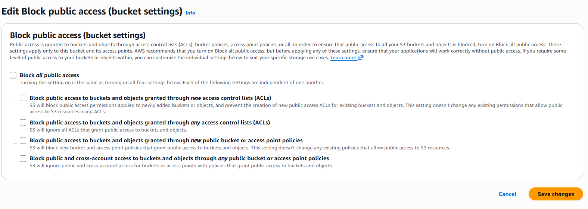
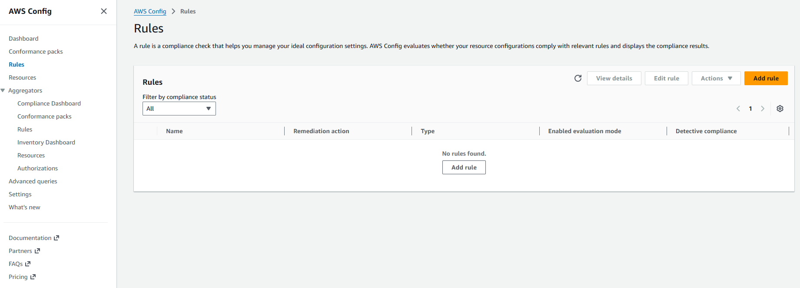
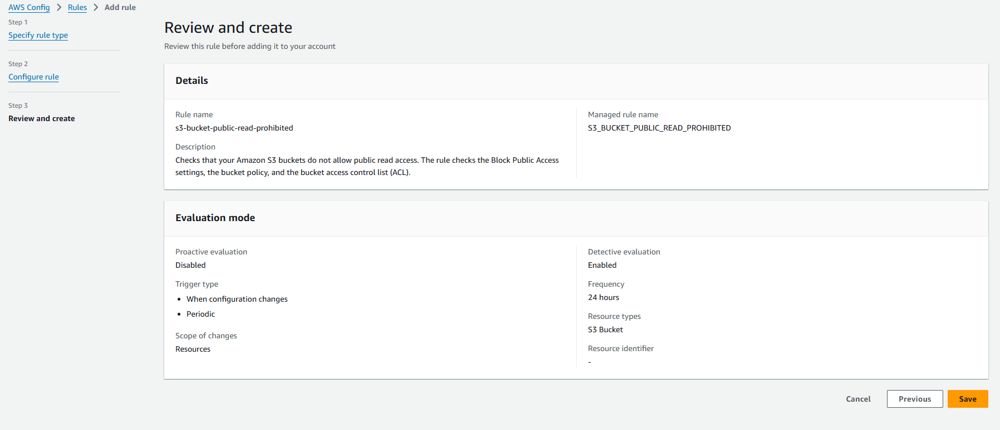
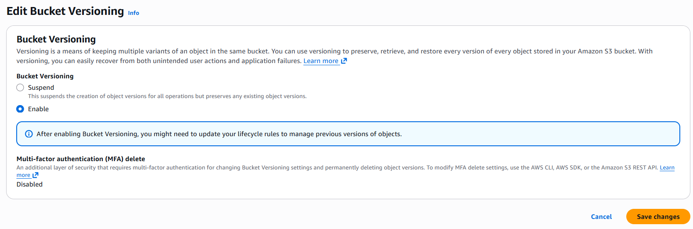

# Secure S3 Bucket – Misconfiguration Detection & Remediation
This project demonstrates how data leaks happen due to S3 misconfigurations and how to detect, prevent, and monitor unauthorized access using native AWS security services.

The goal is to simulate a real-world security incident, fix it using best practices, and implement continuous monitoring.

### Scenario
An S3 bucket is accidentally made public, allowing unauthorized users to read sensitive data.



### Insecure Bucket Policy
```
{
  "Version": "2012-10-17",
  "Statement": [
    {
      "Effect": "Allow",
      "Principal": "*",
      "Action": "s3:GetObject",
      "Resource": "arn:aws:s3:::demo-public-bucket/*"
    }
  ]
}
```
The above bucket policy allows public read access to all objects in the S3 bucket `demo-public-bucket`. This can lead to unauthorized access to sensitive data stored in the bucket.

## Remediation

### Secure Bucket Policy – IAM Principal Only

```
{
  "Version": "2012-10-17",
  "Statement": [
    {
      "Sid": "AllowSpecificRoleAccess",
      "Effect": "Allow",
      "Principal": {
        "AWS": "arn:aws:iam::123456789012:role/S3ReadOnlyRole"
      },
      "Action": "s3:GetObject",
      "Resource": "arn:aws:s3:::secure-demo-bucket/*"
    }
  ]
}
```
Prevents anonymous access and Enforces least privilege


### IP-Based Whitelisting (Office / VPN Access)

```
{
  "Version": "2012-10-17",
  "Statement": [
    {
      "Sid": "AllowFromTrustedIPs",
      "Effect": "Allow",
      "Principal": "*",
      "Action": "s3:GetObject",
      "Resource": "arn:aws:s3:::secure-demo-bucket/*",
      "Condition": {
        "IpAddress": {
          "aws:SourceIp": [
            "203.0.113.10/32",
            "198.51.100.0/24"
          ]
        }
      }
    }
  ]
}
```

### IP-Based Blacklisting (Optional)

```
{
  "Sid": "DenyBlockedIPs",
  "Effect": "Deny",
  "Principal": "*",
  "Action": "s3:*",
  "Resource": [
    "arn:aws:s3:::secure-demo-bucket",
    "arn:aws:s3:::secure-demo-bucket/*"
  ],
  "Condition": {
    "IpAddress": {
      "aws:SourceIp": "203.0.113.50/32"
    }
  }
}
```

Note: Deny always overrides Allow

### AWS Config – Compliance Rules

Enable the config by choosing the default values



Add rule , click on choose AWS managed rule, add the following rules with default values individually one by one & save

**s3-bucket-public-read-prohibited**



**s3-bucket-public-write-prohibited**

These rules:
* Continuously evaluate buckets
* Mark resources NON_COMPLIANT
* Prevent silent exposure

make the bucket public again, by adding a public policy & unblock public access

### CloudTrail
Check the event history
Records: 
```
GetObject
PutObject
DeleteObject
```
Useful for forensics and incident response

### S3 Server Access Logs
Logs:
```
Source IP
Requester
Object accessed
```
Stored in a separate logging bucket


### Enable Versioning for Disaster Recovery



### Enable the object lock for compliance buckets


## Key Security Takeaways

* Public S3 buckets are the #1 cause of data breaches
* Detection without remediation is incomplete
* IAM + IP-based controls provide layered security
* Logging is critical for audit and compliance
* AWS native tools are sufficient when used correctly